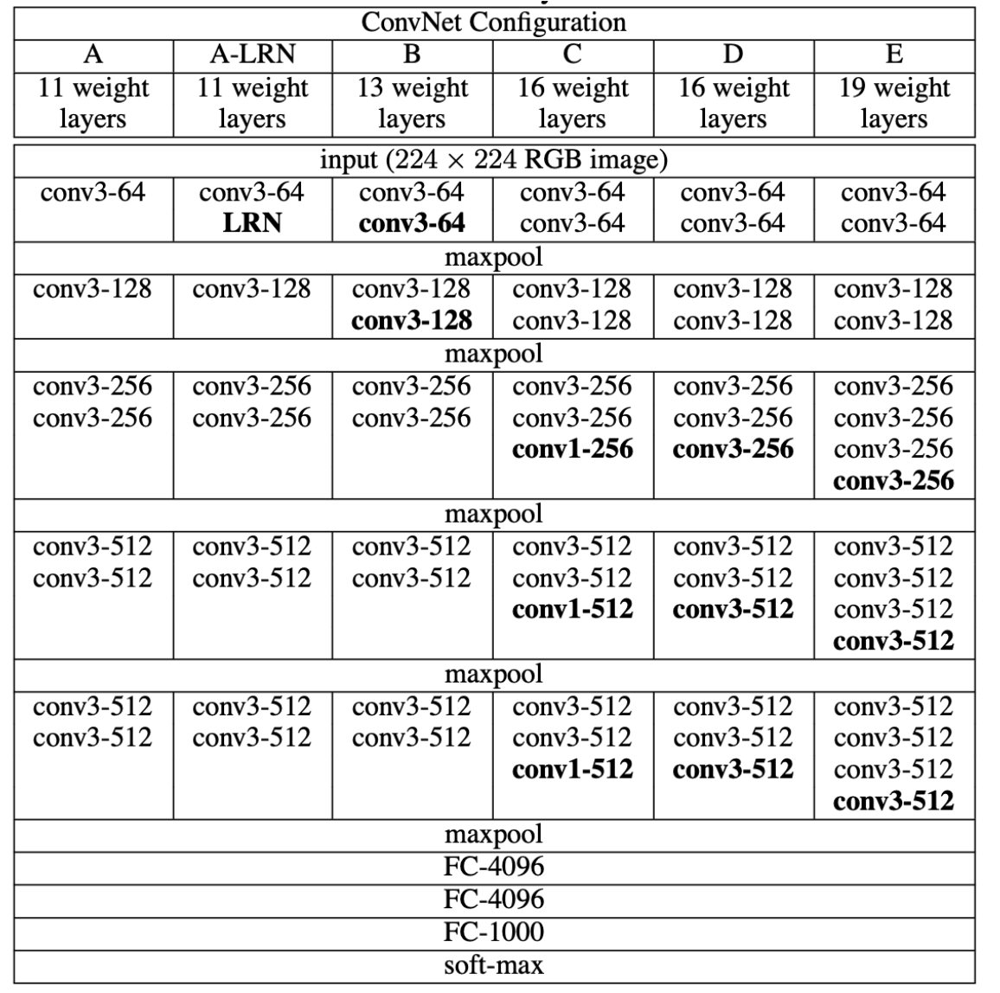
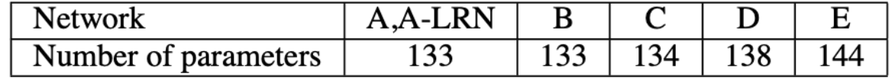
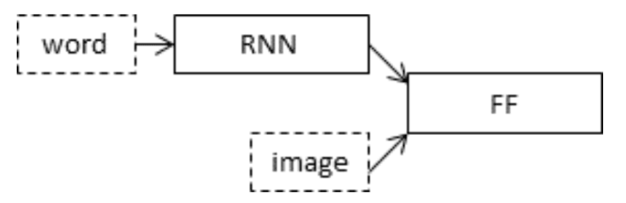
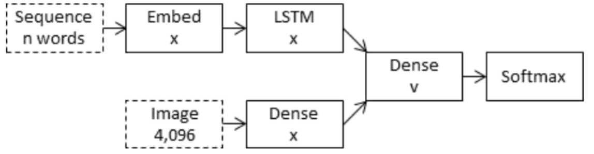
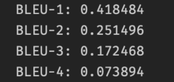
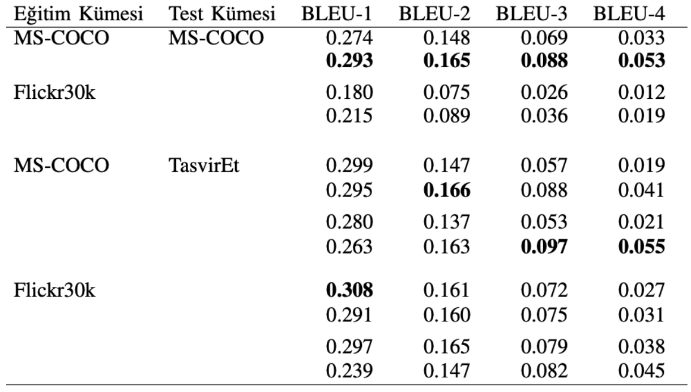
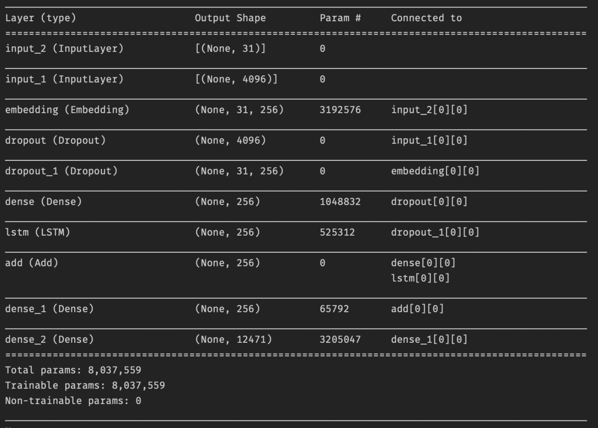
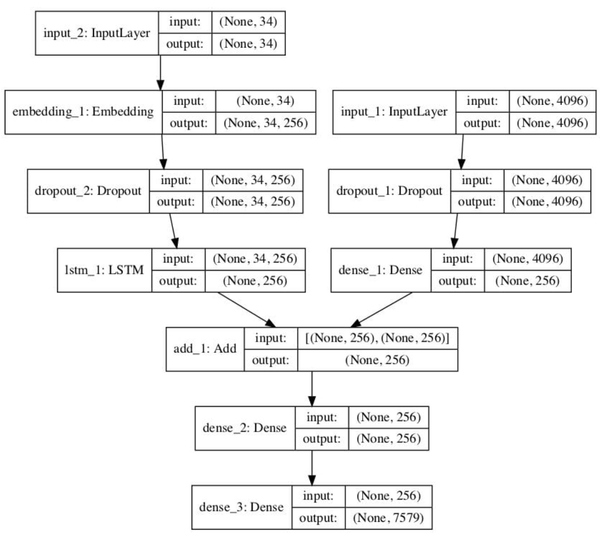

# IMAGE CAPTIONING IN TURKISH LANGUAGE

Release Date - 21.06.2021

Because it is the language of technology, computer science problems and solutions focus on English. In this study, an image captioning problem in Turkish, which has very few examples in the literature, has been solved. The vast majority of approaches to captioning problems encode the image with the language model it uses to describe it using a convolutional neural network (CNN) and a recursive neural network (RNN). This is the method followed in this study.

Image captioning is a challenging artificial intelligence problem in which a textual description is generated for a particular photo. To understand the content of the image, computer vision requires a natural language processing model to translate it into words in the correct order.

Recently, deep learning methods offer state-of-the-art results on this problem. The most important thing about these methods is that they can be captioned by defining a single end-to-end model without the need for complex data preparation or specially crafted pipeline models. This report describes how a deep learning model from scratch does image captioning.

[Flickr8K](https://academictorrents.com/details/9dea07ba660a722ae1008c4c8afdd303b6f6e53b) data was used in this study. This is because it is realistic and relatively small data, allowing it to work using the CPU.

The data has two folders:
Flickr8k_Dataset : Contains 8092 photos in JPEG format. 
Flickr8k_text: Contains a set of files with descriptions for the photos.

The VGG model, which won the ImageNet competition in 2014, was used to interpret the content of the photos.1 This model became part of a broader image captioning model. The problem with the model is that because the model is large, and every time we test a new language model, it runs every photo over the network. Instead, we pre-calculated the photo features using the pre-trained model and saved it to a file. By loading these features later, we fed our model as an interpretation of a particular photo in the dataset. This allowed us to train our models faster and achieve an optimization that would consume less memory.

Since the VGG model is used to predict the classification of a photograph, the last layer of the model has been removed because what we are interested in is not the classification of the images, but the features that the model extracts from the photograph. The model is loaded with the VGG class available in Keras. Also, one of Keras tools was used to resize the uploaded photo to the preferred size for the model.

The VGG model shows the effect of cnn depth for large-scale image recognition. It is a comprehensive handling of incremental deep networks using an architecture with very small (3x3) access filters.

Convolutional networks (CNN) have recently achieved great success in large-scale image and video recognition.

This is made possible by large and publicly available data such as ImageNet, high-performance systems such as GPUs and large-scale distributed clusters.

ConvNet configurations appear in the columns. The depth of the configurations increases from left to right as more layers are added. (A to E) (added layers in bold)

Convolutional layer parameters are shown as conv(converter field size) (number of channels).

 

### Parameter counts (millions)

 

# Model

For captioning and concept perception tasks, encoder-decoder recurrent neural network (RNN) coupling architectures were used due to its success on injection.

 

# Image Captioning Model

The compositing model combines the encoded version of the image input with the encoded version of the text description created so far. These two encoded combinations are then used by a very simple decoder pattern to generate the next word in the sequence.

 

# Comparison

Actual and predicted explanations are aggregated and evaluated as a BLEU score summarizing how close the generated text is to the expected text. BLEU values ​​are used in text translation to evaluate the translated text against one or more reference translations. Here we compare each description created with all the reference descriptions of the photo. The cumulative n-gram BLEU values ​​of 1,2,3 and 4 are then calculated. The closer these values, which we calculated with the corpus_bleu() function in the NLTK Python library, are to 1, the better the result. We can say that the result we got is within the expected range of a competent model. 6000 images were used in the testing phase of this study, which we did with Flickr8K data. Here, the number 6000 was a number set by Flickr. If we compare the results of the Subword Elements and Turkish Image Subtitles study conducted at Hacettepe University, it is seen that better scores are obtained from all BLEU scores.

 

### Our score

 

### Hacettepe University

 

The model was defined as follows.

1- Photo Feature Extractor. This is a 16-layer VGG model pre-trained on the ImageNet dataset. The photos were processed with the VGG model without the output layer, and the attributes predicted by this model were used as input.

2- Sequence Processor. This is a word embedding layer for processing text inputs, followed by the Long Short Term Memory (LSTM) repetitive neural network layer.

3- Decoder. Both the feature extractor and the sequence processor return a fixed-length vector. These are combined and processed by the Dense layer to make a final guess.

The Photo Feature Extractor model expects the input photo features to be a vector of 4,096 elements. These are processed by a Dense layer to produce a 256-element representation of the photo.

The Sequence Processor model expects input sequences of predefined length (34 words), fed by an Embedding layer that uses a mask to ignore padded values, followed by an LSTM layer with 256 memory units.
Both input models produce a 256-element vector. Also, both input models drop out 50% when using regularization. This is to reduce overfitting of the training dataset as the model configuration learns very quickly.
The Decoder model combines vectors from both input models using the addition operator. This is then fed into a 256-neuron Dense layer, followed by a final Dense layer that does a softmax estimate on all output words for the next word in the sequence.

A summary is given below for the structure of the model and the shape of the layers.

The structure of the network to help better understand the two input streams.

